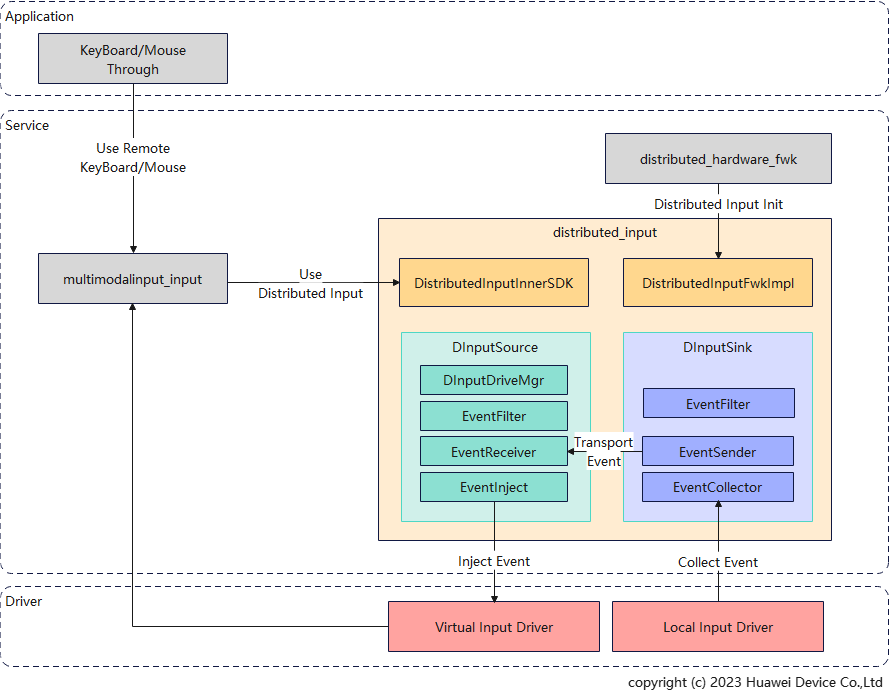

# **分布式输入部件**

## **简介**

分布式输入部件提供了跨设备的键鼠外设输入能力，使一台设备可以使用另一台设备的输入外设（如鼠标，键盘，触摸板等）作为本设备的外设使用，在另一台设备上的操作作用于本设备。

其系统架构图如下图所示：



## **概念说明**

**主控端(source)**：控制端设备，通过分布式输入向被控端设备发送命令，使用周边被控端设备键鼠输入能力的设备。

**被控端(sink)**：被控制端设备，接受主控端发送的命令并且完成对应操作，提供本地键鼠外设供主控端设备使用的设备。

## **架构说明**

**分布式输入主控端(DInputSource)**：使用周边被控端设备键鼠输入能力的设备，称为分布式输入主控端，周边被控端设备键鼠事件可以在主控端生效。

**分布式输入被控端(DInputSink)**：提供本地键鼠外设供主控端设备使用的设备，称为分布式输入被控端，物理键鼠连接在分布式输入被控端。

**分布式输入InnerSDK(DistributedInputSDK)**：为多模输入(multimodalinput_input)模块调用分布式输入能力提供的内部接口。

**分布式输入硬件框架南向扩展实现(DistributedInputFwkImpl)**：实现了分布式硬件管理框架(distributed_hardware_fwk)定义的部件扩展接口，供分布式硬件管理框架调度分布式输入部件能力。

**分布式输入驱动管理(DInputDriverMgr)**：提供分布式输入驱动的添加和删除能力。

**事件过滤(EventFilter)**：提供组合键过滤能力。部分组合键适合在本地生效，例如锁屏键；如果开启了分布式输入能力，被控端键鼠控制主控端设备，被控端锁屏键被多模输入识别后，通过过滤模块判断是否要在本地生效，如果在白名单中，则在本地生效，远端不生效。

**事件采集(EventCollector)**：用于从输入驱动采集键鼠原始事件。

**事件发送(EventSender)**：用于将事件采集模块采集到的原始事件发送到主控端。

**事件接收(EventReceiver)**：用于接收被控端事件发送模块发送的键鼠原始事件。

**事件注入(EventInject)**：用于将被控端发送的键鼠原始事件注入虚拟键鼠驱动。

**本地键鼠驱动(Local KeyBoard/Mouse)**：被控端键鼠在驱动层对应的驱动节点。

**虚拟键鼠驱动(Virtual KeyBoard/Mouse)**：被控端键鼠信息通过分布式硬件管理框架同步信息到主控端后，主控端分布式硬件管理框架调用分布式输入驱动管理功能，在主控端为对应的被控端键鼠创建的虚拟键鼠驱动节点，和被控端键鼠节点对应。

## **目录**

```
/foundation/distributedhardware/distributed_input
├── common                                  # 分布式输入常量定义和公共函数
├── dfx_utils                               # 分布式输入实现DFX业务的相关实现
├── frameworks                              # 分布式输入innerkit接口使用到的回调函数定义
├── inputdevicehandler                      # 分布式输入实现分布式硬件管理框架定义的能力查询接口实现
├── interfaces                              # 分布式输入实现对外接口模块
├── low_latency                             # 分布式输入实现输入事件跨设备低时延传输能力业务
├── sa_profile                              # 分布式输入的SA配置信息
├── services                                # 分布式输入的SA具体实现
│   └── common                              # 分布式输入实现用到的公共常量定义
│   └── sink                                # 分布式输入的sink侧SA实现
│   │   ├── inputcollector                  # 分布式输入的输入驱动原始事件获取
│   │   ├── sinkmanager                     # 分布式输入sink侧业务管理，响应主控端相关业务调用
│   │   └── transport                       # 分布式输入sink侧事件发送
│   └── source                              # 分布式输入的source侧SA实现
│   |   ├── inputinject                     # 分布式输入的原始事件注入
│   |   ├── sourcemanager                   # 分布式输入的source侧业务管理，实现外部相关接口
│   |   └── transport                       # 分布式输入source侧事件接收
|   └── transportbase                       # 分布式输入的驱动事件数据传输接口
├── sinkhandler                             # 分布式输入实现的分布式硬件管理框架定义的sink侧部件接入接口
├── sourcehandler                           # 分布式输入实现的分布式硬件管理框架定义的source侧部件接入接口
└── test                                    # 分布式输入fuzz测试的实现
├── utils                                   # 分布式输入工具类的实现
```

## **约束**

**语言限制**：C++语言。

**组网环境**：必须确保设备在同一个局域网中。

**操作系统限制**：OpenHarmony标准操作系统。


## **接口说明**

分布式输入不提供北向接口，由多模输入子系统提供接口供开发者调用分布式输入的能力。

## **流程说明**

#### **1. 分布式输入初始化**

分布式硬件管理框架启动后，查询本机分布式输入的部件配置，如果发现有相关配置，通过配置加载分布式输入实现的部件接入so，进行本地输入外设的信息查询，以及分布式输入source侧和sink侧的初始化；分布式硬件管理框架将查询到的本地外设信息记录到分布式数据库，在可信设备之间同步。

#### **2. 分布式输入驱动的准备**

分布式硬件管理框架监听数据库数据变化，如果从分布式数据获取到上线的被控端设备同步的输入外设信息，会调用分布式输入主控端注册分布式输入驱动接口，为对端设备外设在本地注册对应的分布式外设，作为对端设备外设的代理；本地新注册的分布式输入外设，会被多模输入管理起来，并供外部应用调用。

#### **3. 使用分布式输入能力**

(1) 应用可以通过调用多模输入的能力查询接口，查询到对端可信设备具有的分布式输入能力。

(2) 应用可以通过调用多模输入的键鼠穿越开关接口，打开键鼠穿越的功能开关。

(3) 应用可以通过调用多模输入的键鼠穿越接口，启动键鼠外设的跨设备输入能力：

- 设备间首次进行键鼠穿越时，分布式输入部件会启动相关的资源准备，包括设备间网络连接的建立以及相关资源线程的启动等；

- 键鼠穿越成功后，分布式输入部件会通知主控端设备开始使用被控端设备的输入外设，此时被控端设备的分布式输入服务采集到输入外设原始事件并回传到主控端，主控端分布式输入接收到事件并注入到对应的分布式输入驱动，多模输入模块获取到注入的被控端外设事件，进行事件处理后在本地生效，从而实现了主控端对被控端输入外设的使用。

(4) 如果键鼠不再需要穿越，应用可以通过调用多模输入的停止穿越接口，通知被控端分布式输入服务不再回传被控端的外设事件，被控端外设事件在被控端本地生效。

(5) 如果业务方停止使用键鼠穿越，应用可以通过调用多模输入的接口关闭键鼠穿越开关，停止使用键鼠穿越能力。

备注：关于多模输入分布式输入相关接口的使用，参见多模输入相关文档。

#### **4. 设备下线**

设备下线后，分布式硬件管理框架去使能下线设备的输入外设，移除分布式输入驱动，此时下线设备的分布式输入外设不可用。

## **相关仓**

****

**分布式硬件子系统：**

设备管理
[device_manager](https://gitee.com/openharmony/distributedhardware_device_manager)

分步式硬件管理框架
[distributed_hardware_fwk](https://gitee.com/openharmony/distributedhardware_distributed_hardware_fwk)

分布式相机
[distributed_camera](https://gitee.com/openharmony/distributedhardware_distributed_camera)

分布式屏幕
[distributed_screen](https://gitee.com/openharmony/distributedhardware_distributed_screen)

分布式音频
[distributed_audio](https://gitee.com/openharmony/distributedhardware_distributed_audio)

**分布式输入
[distributed_input](https://gitee.com/openharmony/distributedhardware_distributed_input)**
